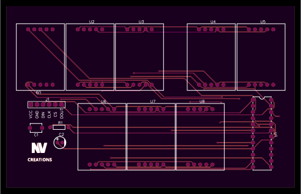
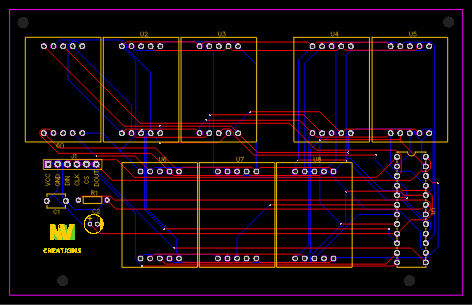
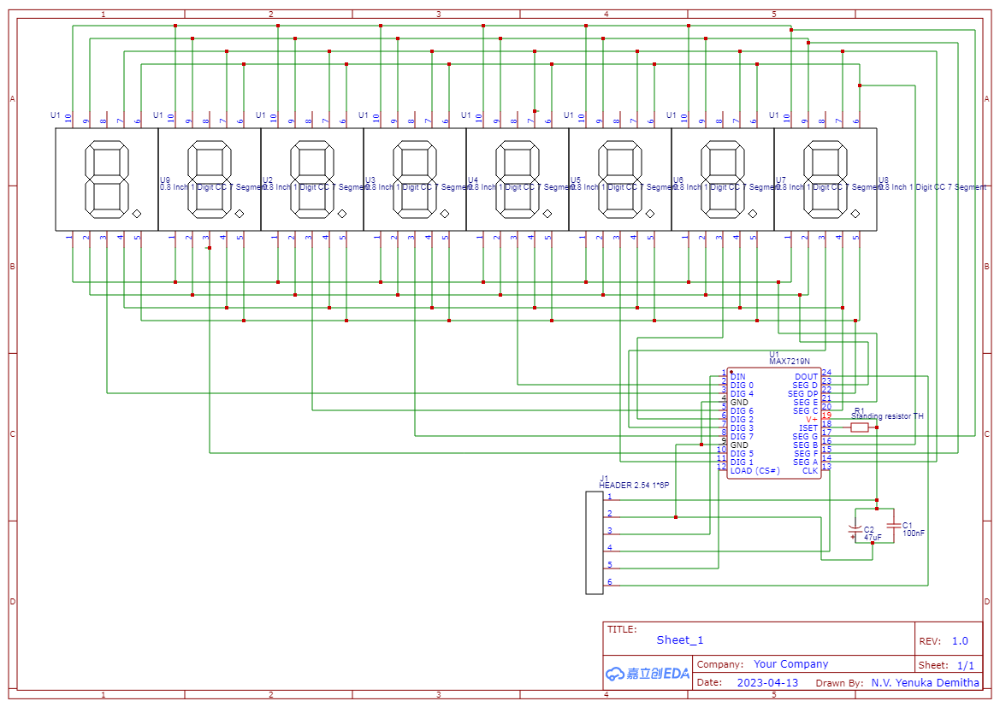

# NV-MAX7219-LargeSeg

A large-digit 7-segment display module powered by the MAX7219 IC, designed for microcontroller integration such as Arduino or Raspberry Pi.

## 📦 What's Included

This repository contains all necessary files for the **NV-MAX7219-LargeSeg** module:

- 🖼️ `PCB_Layout.png` – Visual layout of the board design  
- 📐 `Top_View.svg` – Top-layer vector view of the PCB  
- ⚡ `Schematic_Diagram.png` – Complete schematic for the circuit  
- 💾 `Gerber_Files.zip` – Ready-to-manufacture Gerber files  
- 📁 `Design.json` – EasyEDA design file (importable for modifications)
- 🖊️ `README.md` – This documentation 
- 🧾 `LICENSE` – License information (CC BY-NC-SA 4.0) 

## 🔍 Description

This 7-segment display module is based on the MAX7219 IC and designed to support **large 0.8″ seven-segment displays**, compared to the commonly available 0.36″ modules.

Originally developed as an extension for the [NV-SmartEnv-Controller](https://github.com/NVCreations33/NV-SmartEnv-Controller), this board provides a compact and efficient way to display numeric output without relying on LCDs.

## 🛠️ Features

- Supports large 0.8″ seven-segment LED displays  
- MAX7219 IC for simplified multiplexing and control  
- Microcontroller compatible (Arduino, Raspberry Pi, etc.)  
- Modular and compact PCB layout  
- Optimized for low power and clean display
  
## 📷 Previews

| PCB Top View | PCB Layout | Schematic Diagram |
|--------------|------------|-------------------|
|  |  |  |

---
## 💼 Freelance Customization

If you're interested in a **custom version** of this board (size, segment count, display type, etc.), feel free to reach out.  
This circuit can be easily tailored to other applications.

## 🧾 License

This project is licensed under the  
**[Creative Commons Attribution-NonCommercial-ShareAlike 4.0 International (CC BY-NC-SA 4.0)](https://creativecommons.org/licenses/by-nc-sa/4.0/)**

- ✅ Free for personal and educational use
- ❌ Commercial use **not allowed** without permission
- 🔄 Modifications must be shared under the same license
- ✏️ Credit must be given to the original creator

---
